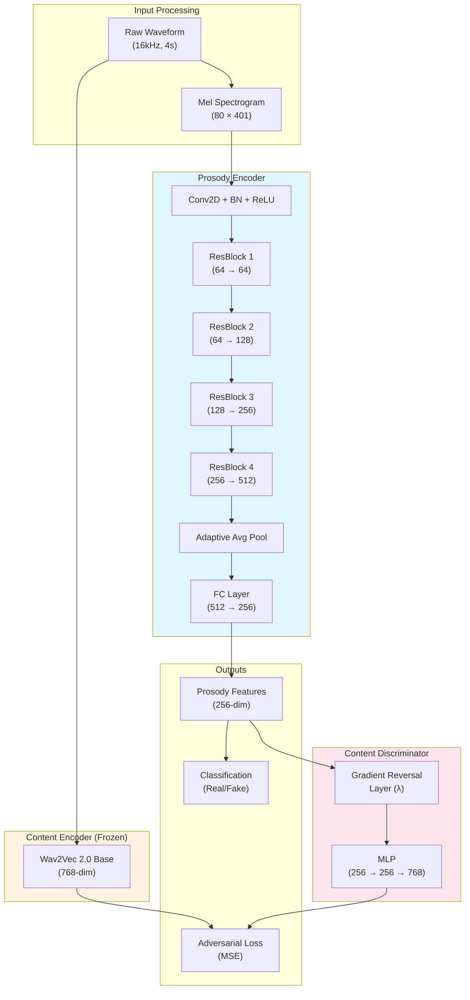
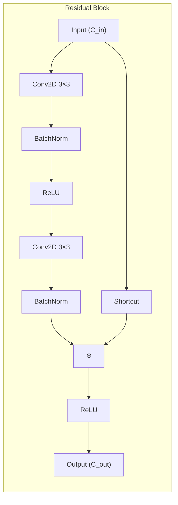
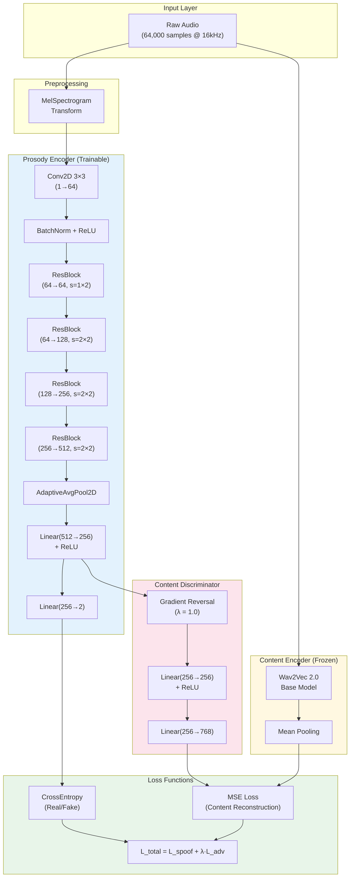

# Adversarial Disentanglement for Audio Deepfake Detection: Model Architecture

## Abstract

This document provides a comprehensive technical description of the proposed adversarial disentanglement framework for audio deepfake detection. The architecture leverages a multi-stream approach combining prosodic feature extraction with content-agnostic learning through gradient reversal, enabling robust detection of synthetic speech across diverse generation methods.

---

## 1. System Overview

The proposed framework consists of three primary components operating in an adversarial training paradigm:

1. **Prosody Encoder** — A ResNet-based convolutional neural network that extracts prosodic features from mel-spectrogram representations
2. **Content Encoder** — A frozen Wav2Vec 2.0 model that captures linguistic content information
3. **Content Discriminator** — An adversarial module with gradient reversal that enforces content-invariant feature learning



---

## 2. Component Specifications

### 2.1 Input Preprocessing

| Parameter | Value | Rationale |
|-----------|-------|-----------|
| Sample Rate | 16,000 Hz | Standard for speech processing |
| Duration | 4 seconds | Captures sufficient prosodic context |
| N_FFT | 400 | 25ms window at 16kHz |
| Hop Length | 160 | 10ms hop (62.5% overlap) |
| N_Mels | 80 | Standard mel filterbank |
| **Output Shape** | **(1 × 80 × 401)** | (Channels × Mel bins × Time frames) |

The mel-spectrogram transformation is defined as:

$$\text{Mel}(f) = 2595 \cdot \log_{10}\left(1 + \frac{f}{700}\right)$$

---

### 2.2 Prosody Encoder Architecture

The Prosody Encoder is a ResNet-inspired convolutional neural network optimized for 2D spectro-temporal feature extraction.

#### 2.2.1 Initial Convolution Block

```
Input: (B, 1, 80, 401)
    ↓
Conv2D(1 → 64, kernel=3×3, stride=1, padding=1)
    ↓
BatchNorm2D(64)
    ↓
ReLU
    ↓
Output: (B, 64, 80, 401)
```

#### 2.2.2 Residual Block Design

Each ResBlock follows the structure:



The shortcut connection is identity when dimensions match, otherwise a 1×1 convolution is applied:

$$\text{Shortcut}(x) = \begin{cases} x & \text{if } C_{in} = C_{out} \text{ and } s = 1 \\ \text{Conv}_{1\times1}(x) & \text{otherwise} \end{cases}$$

#### 2.2.3 Complete Prosody Encoder

| Layer | Input Shape | Output Shape | Stride | Parameters |
|-------|-------------|--------------|--------|------------|
| Conv1 + BN | (1, 80, 401) | (64, 80, 401) | 1 | 640 |
| ResBlock 1 | (64, 80, 401) | (64, 80, 201) | (1, 2) | 73,856 |
| ResBlock 2 | (64, 80, 201) | (128, 40, 101) | (2, 2) | 221,440 |
| ResBlock 3 | (128, 40, 101) | (256, 20, 51) | (2, 2) | 885,248 |
| ResBlock 4 | (256, 20, 51) | (512, 10, 26) | (2, 2) | 3,539,968 |
| AdaptiveAvgPool | (512, 10, 26) | (512, 1, 1) | — | 0 |
| FC1 | 512 | 256 | — | 131,328 |
| FC2 | 256 | 2 | — | 514 |
| **Total** | — | — | — | **~4.85M** |

#### 2.2.4 Forward Pass (PyTorch)

```python
def forward(self, x):
    # x: (B, 1, 80, 401) - Mel spectrogram
    x = F.relu(self.bn1(self.conv1(x)))  # (B, 64, 80, 401)
    x = self.layer1(x)                    # (B, 64, 80, 201)
    x = self.layer2(x)                    # (B, 128, 40, 101)
    x = self.layer3(x)                    # (B, 256, 20, 51)
    x = self.layer4(x)                    # (B, 512, 10, 26)
    x = self.pool(x)                      # (B, 512, 1, 1)
    x = x.view(x.size(0), -1)             # (B, 512)
    
    features = F.relu(self.fc1(x))        # (B, 256) - Prosody features
    out_spoof = self.fc2(features)        # (B, 2)   - Classification logits
    
    return features, out_spoof
```

---

### 2.3 Content Encoder (Frozen Wav2Vec 2.0)

The Content Encoder utilizes a pre-trained Wav2Vec 2.0 Base model to extract rich linguistic representations.

| Property | Value |
|----------|-------|
| Model | `facebook/wav2vec2-base` |
| Architecture | 12-layer Transformer |
| Hidden Size | 768 |
| Parameters | 94.4M (frozen) |
| Output | Mean-pooled hidden states |

The content features $\mathbf{c}$ are computed as:

$$\mathbf{c} = \frac{1}{T} \sum_{t=1}^{T} \mathbf{h}_t^{(L)}$$

where $\mathbf{h}_t^{(L)}$ is the hidden state at time step $t$ from the final transformer layer.

---

### 2.4 Content Discriminator with Gradient Reversal

The adversarial training mechanism employs a Gradient Reversal Layer (GRL) to encourage content-invariant feature learning.

#### 2.4.1 Gradient Reversal Layer

During forward pass, the GRL acts as an identity function. During backward pass, it reverses gradients:

$$\text{GRL}_\lambda(x) = x$$
$$\frac{\partial \text{GRL}_\lambda}{\partial x} = -\lambda \cdot I$$

This forces the Prosody Encoder to learn features that **cannot** be used to predict content, effectively disentangling prosodic cues from linguistic information.

#### 2.4.2 Discriminator Architecture

```
Prosody Features (256)
    ↓
Gradient Reversal Layer (λ)
    ↓
Linear(256 → 256) + ReLU
    ↓
Linear(256 → 768)
    ↓
Predicted Content (768)
```

The discriminator attempts to reconstruct Wav2Vec 2.0 features from prosody features:

$$\mathcal{L}_{adv} = \text{MSE}(\hat{\mathbf{c}}, \mathbf{c})$$

---

## 3. Training Objective

The overall training loss combines spoofing detection and adversarial disentanglement:

$$\mathcal{L}_{total} = \mathcal{L}_{spoof} + \lambda_{adv} \cdot \mathcal{L}_{adv}$$

Where:
- $\mathcal{L}_{spoof}$: Cross-entropy loss for binary classification (real/fake)
- $\mathcal{L}_{adv}$: MSE loss for content prediction (with reversed gradients)
- $\lambda_{adv}$: Adversarial weight (dynamically scheduled)

### 3.1 Dynamic λ Scheduling

The adversarial weight follows a warmup schedule:

$$\lambda(e) = \begin{cases} 0 & \text{if } e < 5 \\ \lambda_{base} & \text{otherwise} \end{cases}$$

This allows the Prosody Encoder to stabilize before introducing adversarial pressure.

---

## 4. Complete Architecture Diagram



---

## 5. Hyperparameters Summary

| Category | Parameter | Value |
|----------|-----------|-------|
| **Audio** | Sample Rate | 16,000 Hz |
| | Max Duration | 4 seconds |
| | Mel Bins | 80 |
| **Model** | Prosody Feature Dim | 256 |
| | Content Feature Dim | 768 |
| | Total Parameters | ~99M (4.85M trainable) |
| **Training** | Batch Size | 16 |
| | Learning Rate | 1e-4 |
| | Optimizer | Adam |
| | Epochs | 50 |
| | Adversarial λ | 1.0 (after warmup) |
| | Warmup Epochs | 5 |

---

## 6. Theoretical Motivation

The adversarial disentanglement framework is motivated by the hypothesis that:

> **Spoofing artifacts reside primarily in prosodic characteristics** (pitch patterns, rhythm, energy contours) **rather than linguistic content**.

By explicitly forcing the Prosody Encoder to learn representations that cannot predict linguistic content (via the reversed gradients from the Content Discriminator), we encourage:

1. **Content-Invariant Features**: The model focuses on prosodic anomalies universal across different speakers and sentences
2. **Generalization**: Features that generalize across unseen text and speakers
3. **Robustness**: Reduced overfitting to specific content patterns in training data

This approach draws inspiration from domain adaptation literature, where gradient reversal has been successfully applied to learn domain-invariant representations.

---

## 7. Implementation Notes

### 7.1 Computational Efficiency
- Content Encoder (Wav2Vec 2.0) is **frozen** — no gradient computation required
- Only ~4.85M parameters need training (5% of total model)
- Mixed precision training supported for GPU acceleration

### 7.2 Data Pipeline
- Streaming dataset loading from HuggingFace Hub
- On-the-fly mel-spectrogram computation
- Balanced sampling of real/fake examples

---

## References

1. Ganin, Y., & Lempitsky, V. (2015). Unsupervised Domain Adaptation by Backpropagation. *ICML*.
2. Baevski, A., et al. (2020). wav2vec 2.0: A Framework for Self-Supervised Learning of Speech Representations. *NeurIPS*.
3. He, K., et al. (2016). Deep Residual Learning for Image Recognition. *CVPR*.
